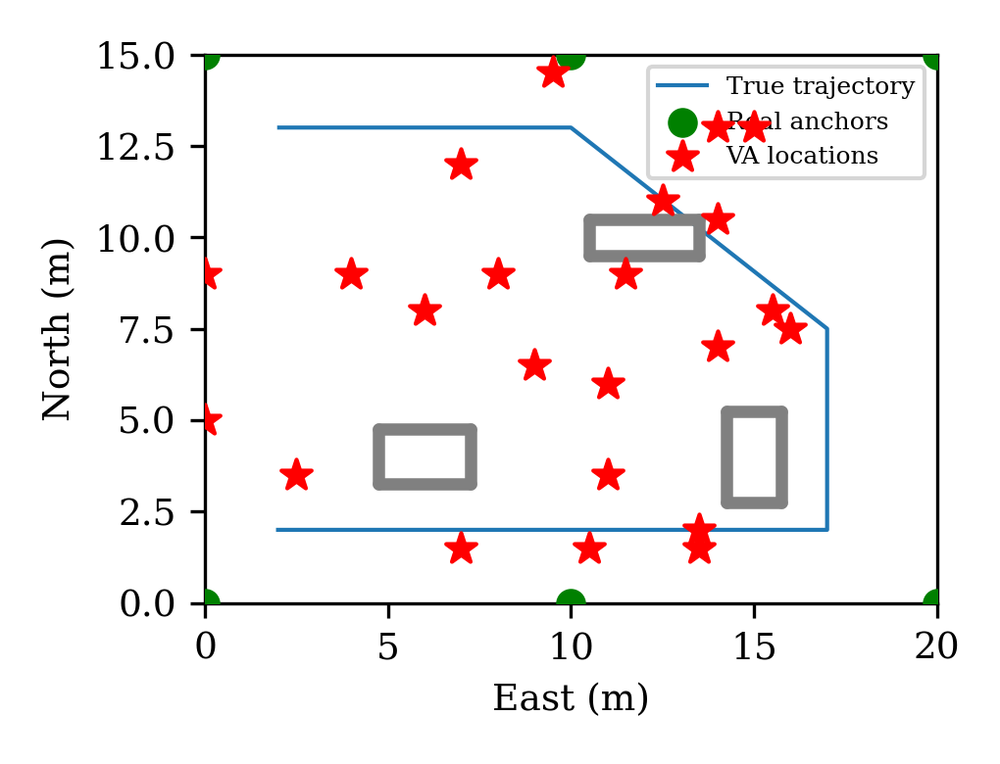
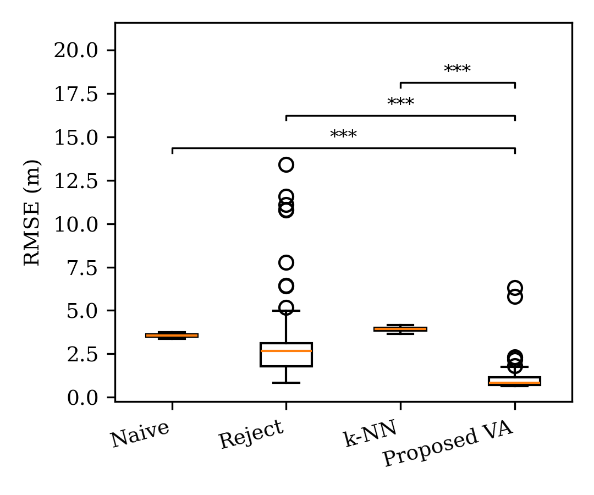
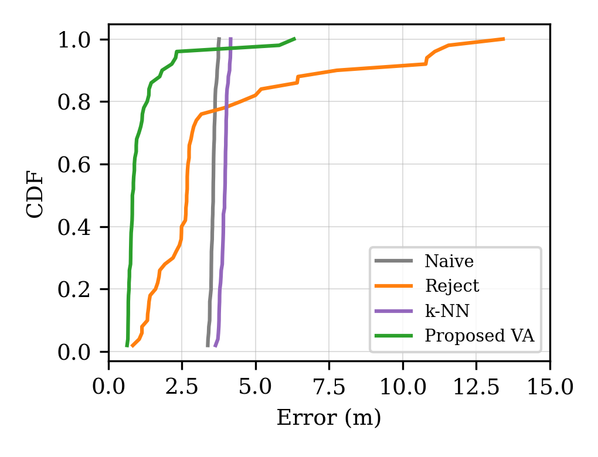
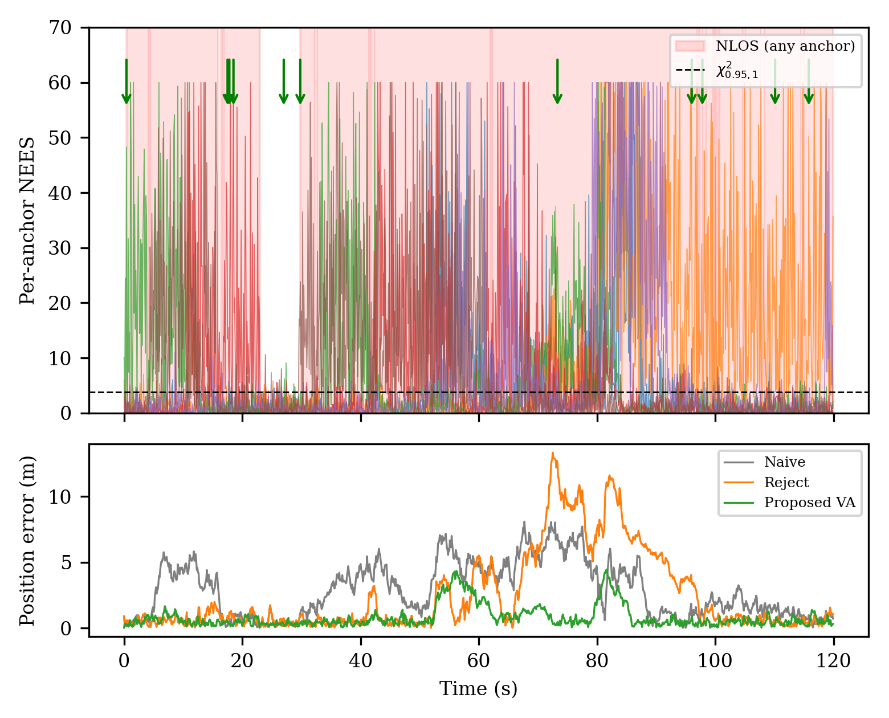
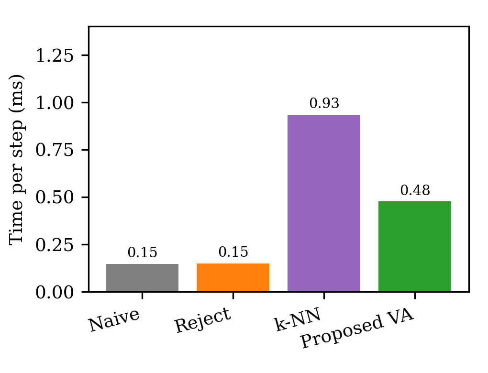

<div align="center">

# NEES-Guided Virtual Anchor Geometry Recovery
### for RSSI-IMU Indoor Localization Under NLOS

[]()
[]()
[]()
[]()
[]()

*Identifying and fixing a self-referential feedback-loop failure in model-based virtual anchors for NLOS-degraded indoor EKF localization.*

Target venue: [SAIROB 2026](https://sairob.acscrg.com/2026/)

</div>

---

## Contents

- [1. Problem](#1-problem)
- [2. Method and Mathematics](#2-method-and-mathematics)
- [3. Simulation Setup](#3-simulation-setup)
- [4. Results](#4-results)
- [5. Repository Structure](#5-repository-structure)
- [6. Running It](#6-running-it)
- [7. Scope, Honesty Notes, and What's Not Claimed](#7-scope-honesty-notes-and-whats-not-claimed)
- [Contact](#contact)

---

## 1. Problem

Indoor localization using WiFi RSSI (received signal strength) fused with
IMU (inertial measurement unit) data is cheap and ubiquitous, but suffers
badly under **non-line-of-sight (NLOS)** propagation — when a wall or other
obstruction sits between an anchor and the tag being tracked. NLOS does two
separate kinds of damage:

1. **Bias** — the RSSI-to-distance model assumes free-space-like decay;
   NLOS adds a large, roughly one-sided excess attenuation that the model
   doesn't account for, so range estimates from that anchor are systematically
   wrong, not just noisier.
2. **Geometric weakness** — the standard fix (drop/down-weight anchors flagged
   as NLOS) removes information. Once fewer than three anchors remain usable,
   2-D position becomes **formally unobservable** from range measurements
   alone (see the Fisher-information argument in §2.3 below) — the filter is
   coasting on IMU dead-reckoning alone until an anchor comes back into view.

**Existing "virtual anchor" (VA) approaches** — placing a synthetic anchor to
patch the geometry — mostly come from machine-learning fingerprint prediction
or offline radio-map interpolation, computed ahead of time from a signal map,
not in response to a live NLOS event. A **model-based** alternative (predict
a synthetic anchor's measurement from the filter's own propagation model,
no signal map needed) sounds simpler but has a **specific, previously
unaddressed failure mode**: if that synthetic measurement is generated from
the filter's *corrected* state (the state produced by the very update the VA
feeds into), a state error can be **reinforced by the very measurement meant
to correct it** — a positive feedback loop, not a recovery mechanism.

This project is about (a) formally identifying that feedback loop, (b)
building a mechanism that avoids it, and (c) validating that mechanism with
real Monte Carlo numbers rather than assuming it works. While validated on a
ground-plane RSSI-IMU testbed, the same problem — an estimator recovering
geometric observability the instant a ranging anchor becomes unreliable —
is a direct analogue of GPS-denied navigation for indoor/subterranean UAS
and multi-agent swarms, where a single lost anchor or relay link removes a
shared reference for every dependent agent at once (see Sec. I–II of the
paper for the full discussion and citations).

---

## 2. Method and Mathematics

### 2.1 Process model

State vector: $\mathbf{x} = [p_N, p_E, v_N, v_E]^{\mathsf{T}}$ (planar
position + velocity, north-east frame). Driven by IMU accelerometer input
$\mathbf{u}_k = [a_N, a_E]^{\mathsf{T}}$:

$$
\mathbf{x}_{k+1} = \mathbf{F}\mathbf{x}_k + \mathbf{G}\mathbf{u}_k + \mathbf{w}_k
$$

$$
\mathbf{F} = \begin{bmatrix} \mathbf{I}_2 & \Delta t\,\mathbf{I}_2 \\ \mathbf{0}_2 & \mathbf{I}_2 \end{bmatrix}, \quad
\mathbf{G} = \begin{bmatrix} \tfrac{1}{2}\Delta t^2\mathbf{I}_2 \\ \Delta t\,\mathbf{I}_2 \end{bmatrix}
$$

with process noise $\mathbf{Q} = \mathrm{diag}(0.01, 0.01, 0.05, 0.05)$.

The model is deliberately planar. Roll/pitch/yaw are assumed supplied
externally (AHRS/magnetometer) and used to rotate raw body-frame
accelerometer readings into this horizontal frame before they enter the
filter — a standard loosely-coupled simplification, stated explicitly rather
than left implicit. A full 3-D deployment (e.g., for UAS) would instead
carry attitude in the state itself — see the paper's Conclusion for this as
future work.

### 2.2 Measurement models

**RSSI** (log-distance path-loss model), anchor $i$:

$$
z_{i,k} = \mathrm{PL}_0 - 10n\log_{10}\!\left(\frac{d_{i,k}}{d_0}\right) + v_{i,k}
$$

where $d_{i,k} = \|\mathbf{p}_k - \mathbf{a}_i\|$, $n = 2.5$ (path-loss
exponent), $\mathrm{PL}_0 = -40$ dB at $d_0 = 1$ m, and
$v_{i,k} \sim \mathcal{N}(0, \sigma_{\mathrm{LOS}}^2)$ with
$\sigma_{\mathrm{LOS}} = 2$ dB. Under NLOS, variance increases:
$R_{i,k} = \sigma_{\mathrm{LOS}}^2 + \sigma_{\mathrm{NLOS}}^2$ with
$\sigma_{\mathrm{NLOS}} \sim \mathcal{N}(8, 4^2)$ dB.

**IMU:** $\mathbf{z}_{\mathrm{IMU},k} = [a_N, a_E]^{\mathsf{T}} + \boldsymbol{\eta}_k$,
$\boldsymbol{\eta}_k \sim \mathcal{N}(\mathbf{0}, \mathbf{R}_{\mathrm{IMU}})$.

### 2.3 Why fewer than 3 anchors breaks observability (Fisher information)

For $M$ anchors in LOS, the position Fisher information matrix under the
log-distance model is

$$
\mathbf{J} = \sum_{i=1}^{M} \frac{1}{\sigma_i^2}\left(\frac{10n}{d_i \ln 10}\right)^{2} \mathbf{r}_i \mathbf{r}_i^{\mathsf{T}}
$$

where $\mathbf{r}_i = (\mathbf{p} - \mathbf{a}_i)/d_i$ is the unit direction
to anchor $i$. This is the same quantity (up to weighting) whose inverse
trace defines GDOP below. When $M < 3$ anchors remain in LOS — or the
survivors are near-collinear with the tag — $\mathrm{rank}(\mathbf{J}) < 2$,
$\mathbf{J}$ is singular, and GDOP diverges: position is no longer
observable from range measurements alone. **This is the exact failure that
anchor rejection can induce, and that GDOP-optimal VA placement is designed
to reverse:** adding a VA row to $\mathbf{J}$ restores rank whenever its
direction is linearly independent of the surviving real anchors.

### 2.4 The feedback-loop problem (the core issue this project addresses)

If a VA pseudo-measurement is generated from the **corrected** state
$\hat{\mathbf{x}}_{k|k}$ rather than the prediction, its innovation at the
next step is:

$$
\boldsymbol{\nu}_{\mathrm{VA}} = h(\mathbf{c}^*, \hat{\mathbf{x}}_{k|k}) - h(\mathbf{c}^*, \hat{\mathbf{x}}_{k|k-1}) + \boldsymbol{\eta}
\approx \mathbf{H}\mathbf{K}\boldsymbol{\nu}_{k-1} + \boldsymbol{\eta}
$$

since $\hat{\mathbf{x}}_{k|k} - \hat{\mathbf{x}}_{k|k-1} = \mathbf{K}\boldsymbol{\nu}_{k-1}$
(the Kalman update itself). This shows the current VA innovation is a
function of the **previous update's innovation**, not of the true state
error — if the previous update happened to move the estimate the wrong way,
the VA tends to *confirm* that move instead of correcting it. That's a
positive feedback loop hiding inside what looks like a correction mechanism.

### 2.5 Three-layer architecture (the fix)

**Layer 1 — Detection (per-anchor NEES).** For anchor $i$ at time $k$:

$$
\epsilon_{i,k} = \boldsymbol{\nu}_{i,k}^{\mathsf{T}} S_{i,k}^{-1} \boldsymbol{\nu}_{i,k} \sim \chi^2_1 \text{ (under LOS)}
$$

NLOS is flagged when $\epsilon_{i,k} > \gamma = 3.84$ (95% confidence) for at
least 3 of the last 5 steps — a sliding-window vote to suppress false alarms
from ordinary multipath fading. Implemented in `Codes/nees_detector.py`.

**Layer 2 — Placement (GDOP-optimal VA).** When anchor $i$ is flagged, a VA
is placed at:

$$
\mathbf{c}^* = \arg\min_{\mathbf{c}_j} \sqrt{\mathrm{tr}\!\left((\mathbf{H}_{\mathrm{geo},j}^{\mathsf{T}}\mathbf{H}_{\mathrm{geo},j})^{-1}\right)}
$$

searched over a grid of the remaining hall area (candidates too close to the
current position estimate are excluded — near that range, small position
error maps to large RSSI error). Minimizing this is equivalent to
maximizing the Fisher information the candidate adds (§2.3), so the chosen
VA is the placement doing the most to restore $\mathrm{rank}(\mathbf{J})$.
Implemented in `Codes/va_optimizer.py`.

**Layer 3 — Safety (breaks the loop from §2.4).** The VA pseudo-measurement
is generated from an **exponentially-smoothed** position estimate,
$\bar{\mathbf{p}}_k = (1-\alpha)\bar{\mathbf{p}}_{k-1} + \alpha\hat{\mathbf{p}}_{k|k}$
($\alpha = 0.15$), not the raw corrected or predicted state — decoupling it
further from the short-timescale correlation identified above. It's assigned
a weaker covariance ($\sigma_{\mathrm{VA}}^2 > \sigma_{\mathrm{LOS}}^2$) than
a real LOS anchor, and before any update is applied, both a per-row and a
whole-vector normalized-innovation-squared (NIS) test run; either failing
skips that measurement (or the whole step) rather than letting it inject a
large, potentially divergent correction. Implemented in `Codes/ekf_va.py`
and `Codes/va_rssi.py`.

<div align="center">


**Figure 1.** Hall layout: real anchors (green), NLOS wall blockers (gray),
one representative true trajectory (blue), and every virtual-anchor
location spawned across that trial (red stars).
</div>

---

## 3. Simulation Setup

| Parameter | Value | Unit |
|---|---|---|
| Hall dimensions | 20 × 15 | m |
| Real anchors | 6 | — |
| NLOS walls | 3 | — |
| Trajectory duration | 120 | s |
| IMU Δt | 0.1 | s |
| Path-loss exponent $n$ | 2.5 | — |
| $PL_0$ at $d_0=1$ m | −40 | dB |
| RSSI noise (LOS) | $\mathcal{N}(0, 2^2)$ | dB |
| RSSI excess (NLOS) | $\mathcal{N}(8, 4^2)$ | dB |
| Process noise $\sigma_p$ | 0.05 | m |
| Process noise $\sigma_v$ | 0.3 | m/s |
| GDOP grid resolution | 0.5 | m |

Four methods compared over **N = 50 Monte Carlo trials**:

| Method | Description | Code |
|---|---|---|
| **Naive** | All anchors used, no NLOS awareness. | `ekf.py` |
| **Reject** | Flagged anchors get $R_i = 10^6$ (effectively dropped). | `ekf_nees.py` |
| **k-NN NLOS** | Training-free baseline: each anchor's RSSI checked against a rolling 20-sample window via $k$-nearest-neighbor distance; flagged anchors rejected the same way as Reject. A lightweight-ML comparator, distinct from the NEES-based detector. | `knn_detector.py` |
| **Proposed VA** | The three-layer method above. | `ekf_va.py` |

All four methods' per-step wall-clock time was **measured directly**, not
estimated (`monte_carlo.py`).

---

## 4. Results

### 4.1 Headline table

| Method | RMSE Mean (m) | RMSE Std (m) | Mean NEES | Avail. < 3 Anch. |
|---|---|---|---|---|
| Naive | 3.56 | 0.09 | 5.48 | 0.00% |
| Reject | 3.61 | 3.00 | 7.70 | 6.51% |
| k-NN NLOS | 3.93 | 0.13 | 5.68 | 1.59% |
| **Proposed VA** | **1.20** | **1.08** | **6.90** | **0.00%** |

> **Headline result:** 66% mean-RMSE reduction vs. naive, 67% vs. rejection,
> with tighter spread than rejection and zero anchor-availability loss.
> Two-sided Wilcoxon signed-rank tests confirm significance at N=50: VA vs.
> Naive p=7.7e-12; VA vs. Reject p=4.4e-9; VA vs. k-NN p=9.8e-14 (all
> p < 0.001).

<div align="center">



**Figure 2 (left).** Per-trial RMSE distribution across all 50 Monte Carlo
trials, four methods, with Wilcoxon signed-rank significance brackets.
**Figure 3 (right).** CDF of per-trial RMSE — the proposed method's
advantage holds across the full trial distribution, not just the mean.
</div>

> **An honest negative result worth keeping visible:** the k-NN baseline did
> **not** outperform naive — it both misses genuine NLOS events and
> false-flags LOS anchors (degrading geometry more than it corrects bias),
> and it was, contrary to its "lightweight" framing, the **most
> computationally expensive** method tested (0.93 ms/step vs. 0.48 ms for
> the proposed method), due to its $O(\text{window}^2)$ pairwise-distance
> computation. This matters for the paper's argument: the gain here comes
> specifically from coupling the filter's own consistency statistic (NEES)
> to geometric recovery, not from "having some ML-flavored detector."

### 4.2 Instrumented safety-layer behavior (measured, not assumed)

Of steps with at least one anchor flagged NLOS: the whole-vector NIS check
skips the full update on **7.5%** of them; the per-row NIS check separately
soft-rejects a further **0.8%** of individual VA measurements that pass the
whole-vector test. Roughly 1 in 13 flagged steps would otherwise have
injected an update the safety layer judged inconsistent with the filter's
own covariance.

<div align="center">


**Figure 4.** One representative trial: per-anchor NEES over time with true
NLOS episodes shaded and VA-activation onsets marked (top panel), and
position error over time for naive/reject/proposed VA (bottom panel) —
NEES excursions coincide with real NLOS episodes, and VA activation follows
shortly after.
</div>

### 4.3 Computational cost (measured)

| Method | Time / step (ms) |
|---|---|
| Naive | 0.15 |
| Reject | 0.15 |
| k-NN NLOS | 0.93 |
| **Proposed VA** | **0.48** |

<div align="center">


**Figure 5.** Measured per-step wall-clock runtime, four methods. All
methods are ~2 orders of magnitude below a 10 Hz (100 ms) real-time budget.
</div>

### 4.4 Figure and data index

All figures are in [`Results/Figures/`](Results/Figures/) as both vector
PDFs (for print/paper use) and PNGs (for quick viewing/embedding), plus a
`single_trial_demos/` subfolder with quick sanity-check images from the
individual `run_*.py` demo scripts (not the paper's headline Monte Carlo
results).

| File | Contents |
|---|---|
| `fig_environment.{pdf,png}` | Hall layout, anchors, walls, trajectory, VA locations |
| `fig_rmse_boxplot.{pdf,png}` | Per-trial RMSE distribution, 4 methods, with significance brackets |
| `fig_cdf.{pdf,png}` | CDF of per-trial RMSE, 4 methods |
| `fig_nees_timeline.{pdf,png}` | Per-anchor NEES timeline + position error, 1 representative trial |
| `fig_computational.{pdf,png}` | Measured per-step runtime, 4 methods |

Raw numeric results backing these figures/tables are in
[`Results/mc_results.npz`](Results/mc_results.npz) (NumPy archive: one
`(50, 3)` array per method — columns are `[RMSE, mean_NEES, availability_%]`
per trial).

---

## 5. Repository Structure

```
.
├── README.md                     <- this file
├── Codes/                        <- all source code
│   ├── env.py                    Hall geometry: anchors + NLOS walls
│   ├── los_checker.py            Line-segment LOS/NLOS ground-truth test
│   ├── trajectory.py             120 s synthetic ground-truth trajectory
│   ├── sensors.py                RSSI + IMU measurement generation
│   ├── ekf.py                    Core EKF (state, predict, update, NIS gating)
│   ├── nees_detector.py          Layer 1: per-anchor NEES NLOS detector
│   ├── ekf_nees.py               EKF + detector wrapper (naive / reject modes)
│   ├── knn_detector.py           k-NN NLOS baseline
│   ├── va_optimizer.py           Layer 2: GDOP-optimal VA placement
│   ├── va_rssi.py                VA pseudo-measurement generation
│   ├── ekf_va.py                 Layer 3 + proposed method (feedback-loop fix)
│   ├── run_baseline.py           Single-trial naive-EKF demo
│   ├── run_nees.py               Single-trial NEES-detector demo
│   ├── run_va.py                 Single-trial VA-spawn demo
│   ├── monte_carlo.py            Full 50-trial x 4-method validation run
│   ├── analysis.py               Text/LaTeX summary table from results
│   ├── fig_environment.py        Generates Fig. 1 / paper Fig. 2
│   ├── fig_rmse_boxplot.py       Generates Fig. 2 / paper Fig. 3 (+ Wilcoxon p-values)
│   ├── fig_cdf.py                Generates Fig. 3 / paper Fig. 5
│   ├── fig_nees_timeline.py      Generates Fig. 4 / paper Fig. 4
│   ├── fig_computational.py      Generates Fig. 5 / paper Fig. 6
│   ├── main.py                   Runs the entire pipeline end-to-end
│   └── requirements.txt
├── Results/
│   ├── mc_results.npz             Raw 50-trial Monte Carlo data (4 methods)
│   └── Figures/
│       ├── fig_environment.{pdf,png}
│       ├── fig_rmse_boxplot.{pdf,png}
│       ├── fig_cdf.{pdf,png}
│       ├── fig_nees_timeline.{pdf,png}
│       ├── fig_computational.{pdf,png}
│       └── single_trial_demos/    Quick-look images from run_*.py scripts
└── Paper/
    ├── paper_final.tex            IEEE-conference-formatted LaTeX source (6-page limit)
    └── paper_final.pdf            Compiled PDF
```

---

## 6. Running It

```bash
cd Codes
pip install -r requirements.txt
python main.py
```

This runs, in order: environment/trajectory demo → EKF baseline demo → NEES
detector demo → VA spawn demo → full Monte Carlo (4 methods × 50 trials,
~2–3 minutes, dominated by the k-NN baseline's $O(\text{window}^2)$ cost) →
text/LaTeX summary → final IEEE-styled figures (PDF + PNG at 300 DPI, saved
back into `Codes/`; copy into `Results/Figures/` to match this repository's
layout, or point `main.py`'s output paths at `../Results/Figures/`).

If you only want to **regenerate figures** from the existing
`Results/mc_results.npz` (skipping the Monte Carlo re-run), copy it next to
the `fig_*.py` scripts and run them directly, e.g.:

```bash
cp ../Results/mc_results.npz .
python fig_rmse_boxplot.py
```

**Compiling the paper:**

```bash
cd Paper
sudo apt-get install texlive-latex-base texlive-latex-extra texlive-publishers  # provides IEEEtran.cls
pdflatex paper_final.tex
pdflatex paper_final.tex   # run twice to resolve cross-references and the bibliography
```

The paper's figures are referenced by filename only, so keep
`Results/Figures/*.pdf` alongside `paper_final.tex` (or adjust the
`\includegraphics` paths) when recompiling.

---

## 7. Scope, Honesty Notes, and What's Not Claimed

- This is simulation-only, in a synthetic hall with a synthetic trajectory —
  not validated on real hardware or a real building yet.
- The novelty claim (analyzing this specific feedback-loop mechanism in VA
  literature) is stated in the paper as an observation from the related
  work reviewed (Sec. II), not a verified, exhaustive priority claim.
- The IMU-drift robustness discussion in the paper is an **analytic bound**
  from the simulation's own noise parameters, not a separately measured
  quantity — the paper says so explicitly rather than blurring the two.
- **Known limitations** (detailed in the paper's Conclusion): the method
  handles at most one simultaneously-NLOS anchor per event window; the
  environment is static over the 120 s trial; and the state omits attitude,
  assuming a planar deployment with externally-supplied heading.

---

## Contact

<div align="center">

**Muhammad Ibaad**
Dawood University of Engineering and Technology, Karachi, Pakistan
[ibaadsajidshaikh18@gmail.com](mailto:ibaadsajidshaikh18@gmail.com)

*Submitted to [SAIROB 2026](https://sairob.acscrg.com/2026/). Citation
details will be added here once available.*

</div>
